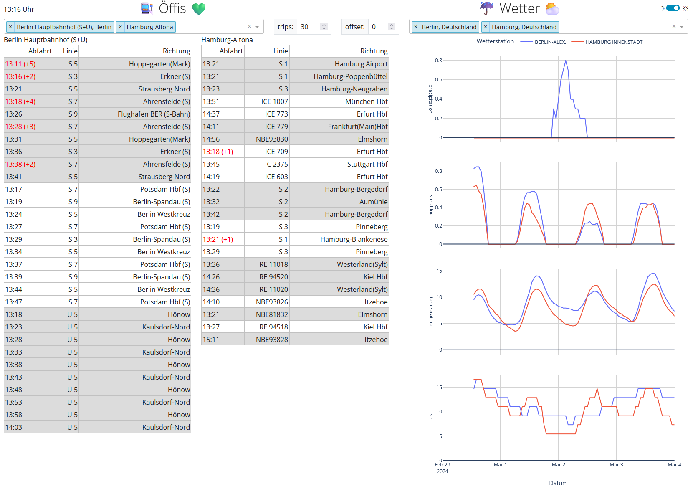

# Installation

After installing python ~3.11~ run the following commands in your project directory to install the virtual environment

```commandline
pip install pipenv
pipenv install
```

Alternatively, you can build a docker container, e.g., with `docker-compose build`.

## Geocoder API-Key
You might want to get an API-key for the Here geocoder API. Technically, there is a fall-back to the Nominatim service
but this is usually too busy. The an error: "geopy.exc.GeocoderAuthenticationFailure: apiKey invalid. apiKey not found."
is thrown.

Get the Here-API-key [here](https://www.here.com/docs/bundle/identity-and-access-management-developer-guide/page/topics/plat-using-apikeys.html),
it's free. Then insert the API-key in the file `config/api_keys.json`.

# Usage

- Run `python dashboard.py` or start the docker container with `docker-compose up` then open a browser webpage
  at [http://localhost:8050](http://localhost:8050).
- In the top right corner is a little switch between light and dark mode.
- In the 'Öffis' (public transportation) column you can pick different stations whose departures will be shown below.
  The number of trips displayed can be chosen as well as an offset of the time. The latter means that for this offset in
  minutes, no departures will be displayed. It can stand for a time you need to reach the station. Actually, this works
  only for german stations since it gets the data from HAFAS.
- In the 'Wetter' (weather) column, you can add your weather stations of choice. This should work world-wide.

